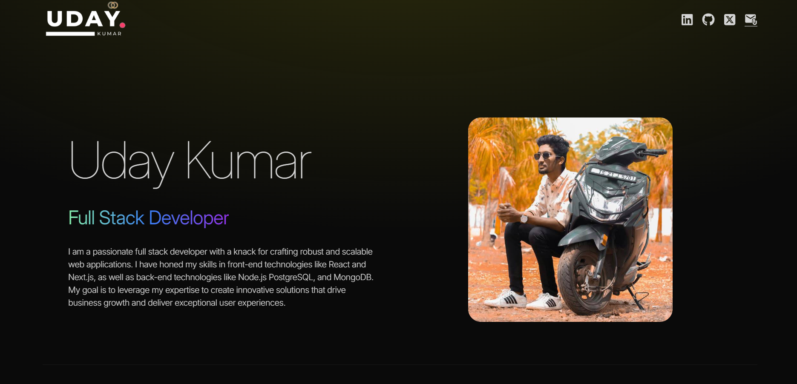

# Portfolio Website

A sleek and responsive personal portfolio website built with **React&Tailwind Css** and **Framer Motion** for smooth animations and transitions. This project showcases projects, skills, and personal details with an engaging user interface.

---

## 📸 Screenshots
### Homepage



## Features

- **Responsive Design**: Works across desktop, tablet, and mobile screens.
- **Framer Motion Animations**: Smooth page transitions, animations, and interactive elements.
- **Project Showcase**: Display of personal projects with detailed descriptions and links.
- **Skills & Experience Section**: Highlights technical skills and professional background.

---

## Tech Stack

- **Frontend**: React.js  
- **Animation Library**: Framer Motion  
- **Styling**: Tailwind CSS 
- **Deployment**: Vercel

---

## Installation and Setup

To run this project locally, follow these steps:


### Prerequisites

- **Node.js** and **npm** installed on your machine.

### Clone the Repository

```bash
git clone https://github.com/uday778/portfolio.git
cd portfolio-website


### Project Structure

portfolio/
│
├── public/            # Static assets (HTML, favicon, etc.)
├── src/
│   ├── components/    # Reusable components (Navbar, Footer, etc.)
│   ├── constants/     # Constants used across the project
│   ├── index.css      # Tailwind CSS global styles
│   ├── app.js         # Main App component
│   ├── index.js       # Entry point for React rendering
│   └── main.js        # Application initialization logic
│
├── tailwind.config.js # Tailwind CSS configuration
├── vite.config.js     # Vite configuration
├── .gitignore         # Files to ignore in Git
├── package.json       # Project dependencies and scripts
└── README.md          # Project documentation

## 📞 Contact

If you have any questions or suggestions, feel free to reach out!

- **Email**: [uday33379@gmail.com](mailto:uday33379@gmail.com)  
- **LinkedIn**: [ LinkedIn](https://www.linkedin.com/in/uday778/)  
- **GitHub**: [ GitHub](https://github.com/uday778)  
- **Portfolio Website**: [https://your-portfolio-site.com](https://your-portfolio-site.com)


